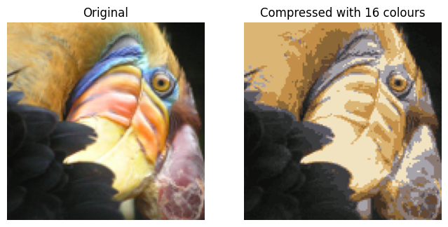

# 🎨 K-Means Image Compression

This notebook shows how **K-Means Clustering** can compress an image by reducing its color palette, keeping visual quality intact while minimizing file size.

---

## 🧠 Why This Matters

Traditional compression methods like JPEG use **PCA** or **DCT** to eliminate spatial redundancy.

K-Means takes a different route — it compresses the image by reducing **color complexity**, clustering similar RGB values.

---

### 🔍 What it does:
- Applies unsupervised clustering (K-Means) to pixel RGB values
- Compresses an image by reducing thousands of colors to just 16
- Visual comparison of **original vs compressed** image

  
## 📊 Method Comparison

| Method         | Type           | What it reduces     | ML-based? | Output size | Info loss |
|----------------|----------------|----------------------|------------|--------------|------------|
| JPEG           | Transform-based| Frequency Redundancy | ❌         | High         | Medium     |
| PNG            | Lossless       | Redundant Bytes      | ❌         | Low          | None       |
| PCA            | Linear algebra | Feature Space         | ⚠️ Semi     | Low          | Some       |
| **K-Means**    | Clustering     | Pixel Color Values    | ✅         | Medium       | Low        |

---

### 📊 Results

### 🚀 Run it
- Clone this repo or open the notebook in [Google Colab](https://colab.research.google.com/)
- Try adjusting the number of clusters `K` to see quality vs. compression

---

Built using concepts from Andrew Ng’s Machine Learning Specialization.

